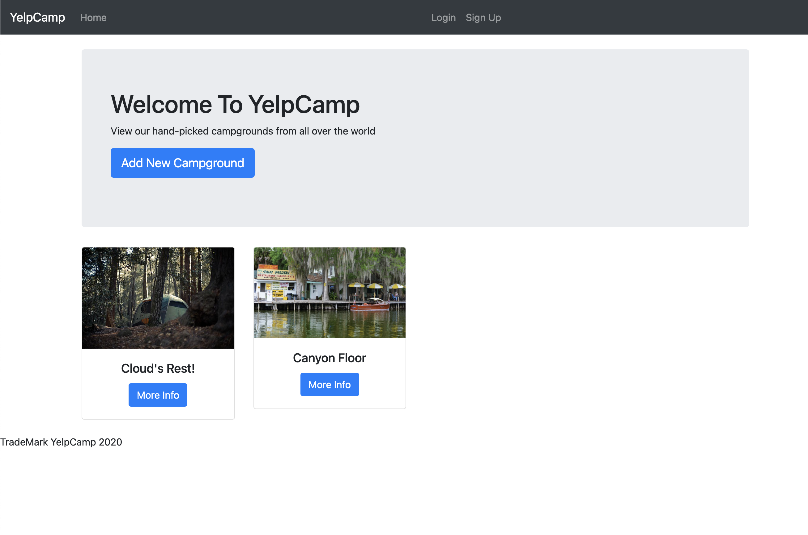
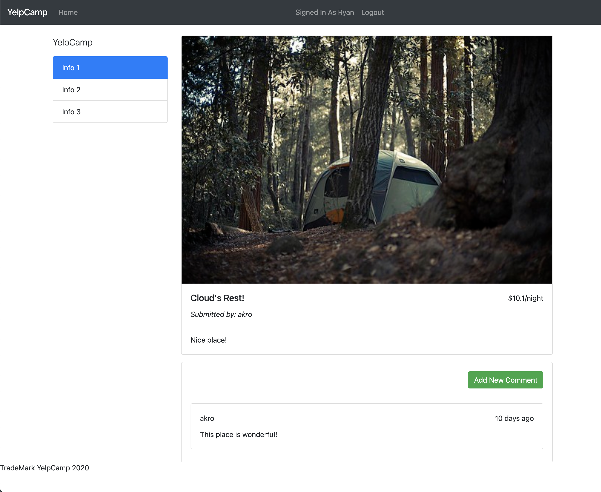

# YCampgrounds Review Web ApplicationelpCamp
## 

* YelpCamp is a web application that enables users to sign up and log in to create and review campgrounds. This project was from Colt Steele's web development course on Udemy.  

## Technology Stacks
* Node.js
* Express
* MongoDB
* Bootstrap
* Passport.js  

# File Structure
```
routes/
    campgrounds.js
    comments.js
    index.js
views/
    landing.ejs
    login.ejs
    register.ejs
    campgrounds/
        edit.ejs
        index.ejs
        new.ejs
        show.ejs
    comments/
        edit.ejs
        new.ejs
    partials/
        footer.ejs
        header.ejs
middleware/
    index.js
models/
    campground.js
    comments.js
    user.js
public/
    stylesheets/
        landing.css
        main.css
app.js
seed.js
```

## Features
* Users can sign up a new account, and login to the web application using username and password
* Users can create, edit, and remove their own campgrounds
* Users can add review to any campground, and their reviews can be edited or removed

# UX/UI
## Landing page


## Home page


## Info page
